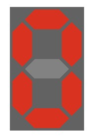
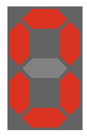

## Krok 2 - WebComponent - komponent html'a

[WebComponent](https://developer.mozilla.org/en-US/docs/Web/Web_Components) jest narzędziem pozwalającym na tworzenie reużywalnych elementów html, całowicie enkapsulowalnych, o własnej logice działania. Może o nich myśleć jak o własnych elementach np formularzy, ale nie tylko.

### Klasa `segmentBox`

Nowy komponent opisywany jest za pomoc klasy javascript dzieciczącej po `HTMLElement`. Podstawowym konceptem w WebComponent jest lokalne drzewo DOM zwane `shadowDOM` które opisuje element od strony HTML. `shadowDOM` można traktować jak małą stronę www opisującą cały nasz element. Logika działania elementu zapisana jest w klasie javascipt.

W naszym przypadku stwórzmy sobie klase `segmentBox` opisującą nasz wyświetlacz 7-segmentowy i umieśćmy ją w pliku `segment-box.js`

Po strorzeniu klasy, nalezy ją zarejestrować jako nowy element html.

```javascript
window.customElements.define('segment-box', segmentBox);
```

Definicje klasy css wykorzystywanych przez nasz wyświetlacz umieścmy w pliku `segment-box.css`

W konstruktorze klasy `segmentBox` tworzymy strukturę DOM naszego wyświetlacza, dołączamy lokalnie plik CSS. 

```javascript
class segmentBox extends HTMLElement {
  STYLES = `
  <link rel="stylesheet" href="./css/segment-box.css" />`;

  HTML = `
  <div class="segment digit-0">
    <div class="bar-h bar-a"></div>
    <div class="bar-h bar-b"></div>
    <div class="bar-h bar-c"></div>
    <div class="bar-v bar-v-t bar-d"></div>
    <div class="bar-v bar-v-t bar-e"></div>
    <div class="bar-v bar-v-b bar-f"></div>
    <div class="bar-v bar-v-b bar-g"></div>
  </div>`;
  
  constructor() {
    super();

    this.shadow = this.attachShadow({ mode: 'open' });

    const template = document.createElement('template');
    template.innerHTML = this.STYLES + this.HTML;
  
    this.shadow.appendChild(template.content.cloneNode(true));
  }

};
```

W pliku `index.html` podłaczmy skrypt `segment-box.js` i dodajmy pojedynczą instancje elementu `segment-box`

```html
<!DOCTYPE html>
<html>
  <head>
    <meta charset="utf-8" />
    <title>Digital Clock Tutorial</title>
    <meta name="viewport" content="width=device-width, initial-scale=1" />
    <script src="js/segment-box.js"></script>
    <style>
      body {
        margin: 10px;
        padding: 0;
      }
    </style>
  </head>
  <body>
    <segment-box></segment-box>
  </body>
</html>
```



### Redukcja drzewa DOM

Element `<segment-box>` jest elementem drzewa DOM do którego jako dzieci podpieliśmy element `div` klasy `segment` i pozostały elementy. Podowuje to że mamy nie potrzebnie jeden element hierarchi. Miło by było aby role naszego kontenera `segment` pełnić element `<segment-box>`. 

W pierwszej kolejności możemy z zmiennej `HTML` usunąć kontener klasy `segment`

```javascript
HTML = `
  <div class="bar-h bar-a"></div>
  <div class="bar-h bar-b"></div>
  <div class="bar-h bar-c"></div>
  <div class="bar-v bar-v-t bar-d"></div>
  <div class="bar-v bar-v-t bar-e"></div>
  <div class="bar-v bar-v-b bar-f"></div>
  <div class="bar-v bar-v-b bar-g"></div>
  `;

```
jego rolę przejmie element `<segment-box>`. Z wnętrza `shadowDOM` ostylowanie elementu nadrzędnego do którego podpięty jest dany `shadowDOM` odbywa się za pomocą pseudo elementu `:host`. A wiec w pliku `segment-box.css` zamieniamy definicje klasy `segment` na pseudoelement `:host`

```css
:host /*, segment*/ {
  --s-width: 60;
  --s-height: 100;
  --s-color: #626262;
  --bar-thickness: 20;
  --bar-padding: 2;
  --bar-color-on: red; /*#f6fa10;*/
  --bar-color-off: #828282;
  position: relative;
  left: 0;
  top:0;
  display: inline-block;
  width: calc(var(--s-width)*1px);
  height: calc(var(--s-height)*1px);
  background-color: var(--s-color);
}
```


Znikneły elementy aktywne. Ponieważ nasz element `segment-box` nie ma przypisanej klasy `digit-0`, dodanie go nie rozwiązuje jednak całkowicie problemu
```html
<segment-box class="digit-0"></segment-box>
```
Mianowicie z wnetrza `shadowDOM` sprawdzenie jakiej klasy jest element nadrzędny i zastosowanie odpowiedniego warunkowego sylowania odbywa się za pomocą pseudoelementu `:host(.klasa)`, gdzie `.klasa` jest klasą przypisaną elementowi nadrzednemu (np `digit-0`). W celu poprawej obsługi klasy określojąca którą cyfrę należy wyświetlić, zmienić trzeba definicje klass `digit-0` na `:host(.digit-0)`

```css
/* 0 definition */
:host(.digit-0) .bar-a { --bar-color: var(--bar-color-on) }
:host(.digit-0) .bar-b { --bar-color: var(--bar-color-off) }
:host(.digit-0) .bar-c { --bar-color: var(--bar-color-on) }
:host(.digit-0) .bar-d { --bar-color: var(--bar-color-on) }
:host(.digit-0) .bar-e { --bar-color: var(--bar-color-on) }
:host(.digit-0) .bar-f { --bar-color: var(--bar-color-on) }
:host(.digit-0) .bar-g { --bar-color: var(--bar-color-on) }
```
po tym zabiegu nasz nowy element `segement-box` działa jak należy



[Index](../readme.md)