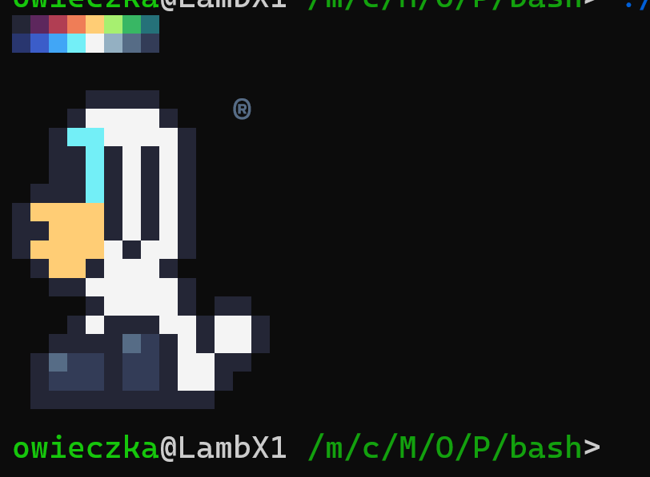
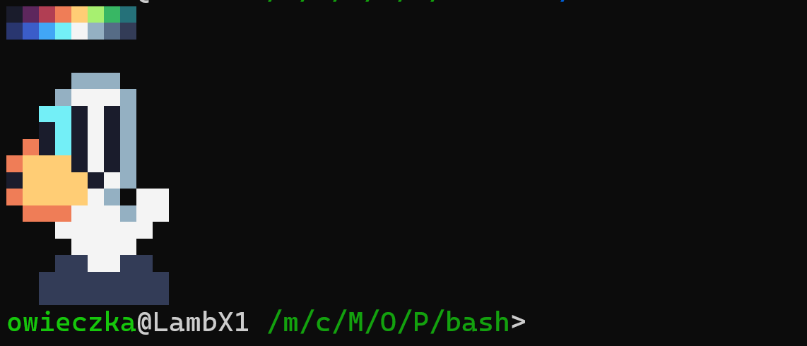

# Terminal Logo

It is nice to have some personal terminal logo welcome screen. Mine is simple Little Lamb image. 

  
I have put mine personal logo in two small bash scripts [`lamb20.sh`](https://github.com/owieczka/linux-cfg/blob/main/terminal-logo/lamb20;sh) and [`lamb16.sh`](https://github.com/owieczka/linux-cfg/blob/main/terminal-logo/lamb16;sh) I'm using excellent [sweetie-16](https://lospec.com/palette-list/sweetie-16) pallete by [GrafxKid](http://grafxkid.tumblr.com/palettes).

